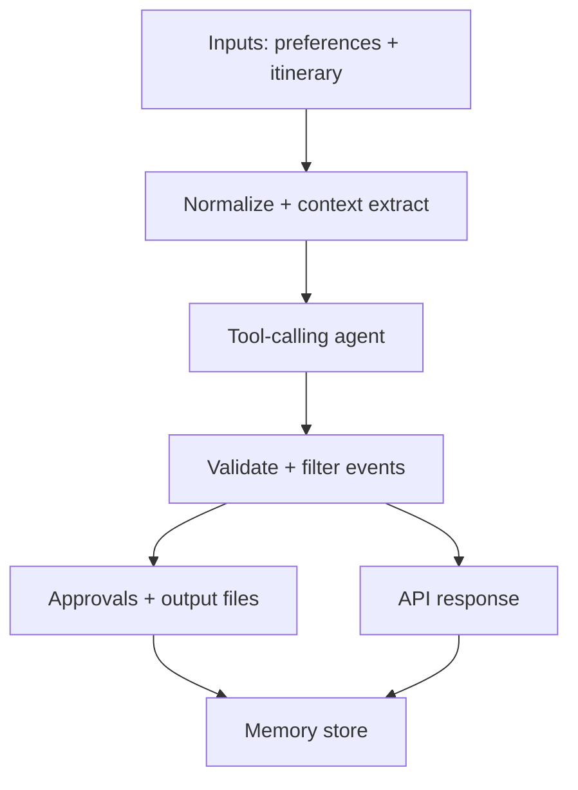

# Design Rationale

## Architectural Overview
The agent runs as a CLI pipeline:
1. Load user preferences (free-text) and itinerary (Excel).
2. Normalize itinerary rows into a compact text summary.
3. Invoke a LangChain tool-calling agent with:
   - Preferences
   - Itinerary summary
   - Prior memory state (events already seen)
4. The agent uses `web_search` and `web_scrape` to gather evidence.
5. The agent returns structured JSON events.
6. The CLI asks for approval and writes approved changes to a text file.
7. Memory (events, approvals, history) is persisted in `outputs/state.json`.

Mermaid diagram (API and CLI share the same core pipeline):

## Framework Choice
LangChain was selected for fast tool-calling setup and its built-in agent
execution patterns. It provides flexible prompt construction, tool integration,
and output parsing without extra orchestration layers. The limitation addressed
was ensuring tool usage; this is handled by validating tool calls (first tool
must be `web_search`, every referenced source must be scraped) and prompting
again if needed.
Structured output is enforced via Pydantic parsing, with retries when required
fields or ISO dates are missing. Additional guardrails filter hazards and
opportunities based on evidence and itinerary relevance.

## Tool Explanation
- `web_search`: Uses DuckDuckGo HTML search to gather URLs related to hazards
  and opportunities for the given locations/dates.
- `web_scrape`: Fetches a URL and extracts text for evidence snippets.
- `official_hazard_search` / `official_hazard_scrape`: Target official sources
  (JMA, MOFA, MLIT, and `go.jp` domains) to ground hazard alerts in
  authoritative advisories. Domains can be configured via `OFFICIAL_DOMAINS`.
These tools provide traceable, live context to support hazard alerts and
opportunity suggestions.

## Memory & Context Strategy
Preferences (free-text) and the normalized itinerary summary are injected into
the prompt to enable contextual reasoning. Memory is stored in a JSON file with
events already detected, approvals, and history. The agent receives a summary
plus the raw event list to avoid duplicates, and a rejection TTL policy blocks
re-suggesting recently rejected changes.

## Time Sensitivity Strategy
The CLI extracts an itinerary date range and constructs explicit queries (weather
forecast, strikes, advisories) that include the relevant cities and dates. After
the agent responds, events are filtered to ensure their dates fall within the
trip window.

## API Approval Flow
The backend service is intentionally split into two steps: `/detect-events` returns
the proposed events, and `/approve` records approvals/rejections. This keeps the
approval UI client-side while the service persists the final change list.
For end-to-end API runs, `/detect-events-with-approvals` combines detection and
approval in one call.

## Evidence Policy
Every event must include scraped source URLs with text snippets. The agent is
validated to call `web_search` first and then `web_scrape` each cited URL. Hazards
require official-domain sources when configured (via `OFFICIAL_DOMAINS`).

## Memory Policy
Events are deduped using deterministic IDs; approvals and run history are stored
in `outputs/state.json`. Recently rejected events are blocked for a short TTL to
avoid repeated suggestions.

## Known Limitations
- Official hazard sources default to Japan government domains unless
  `OFFICIAL_DOMAINS` is configured.
- Event dates must be ISO `YYYY-MM-DD` to pass filtering.
- The itinerary loader requires the columns `day`, `date`, `start_time`,
  `end_time`, and `city`.
